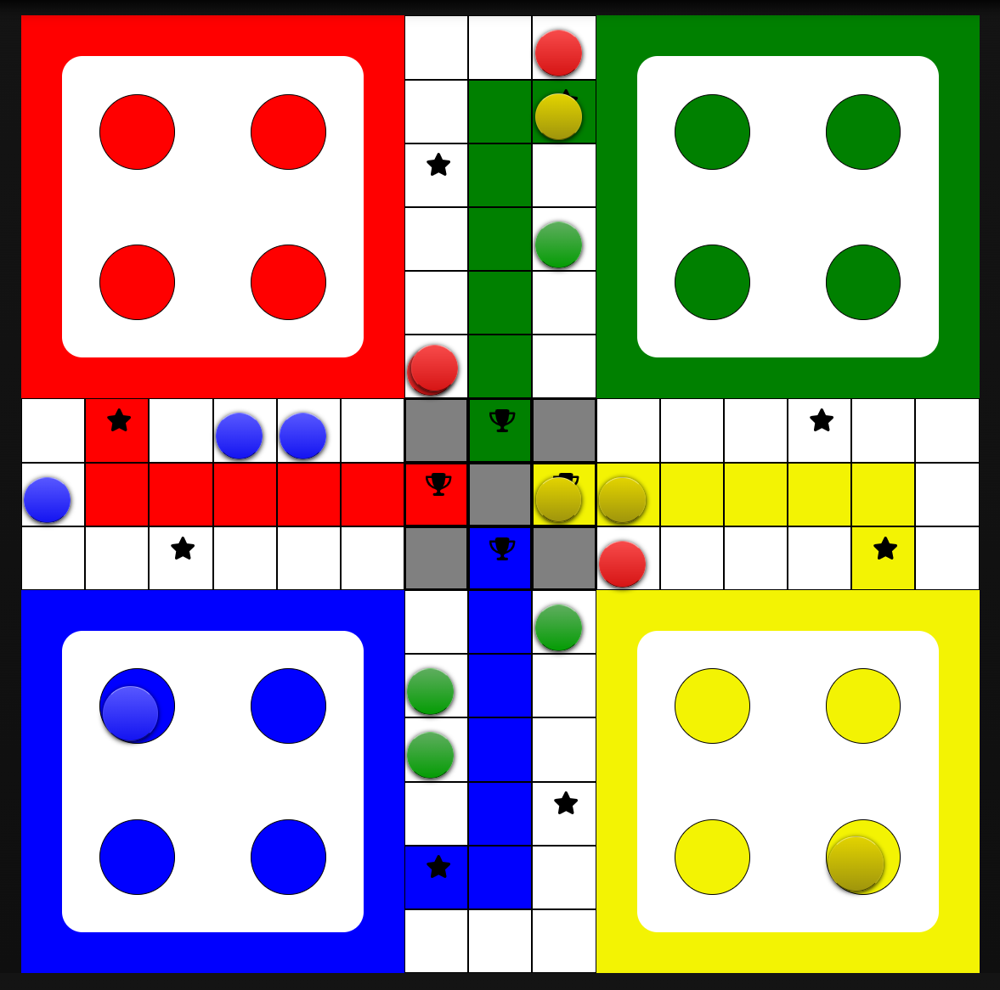
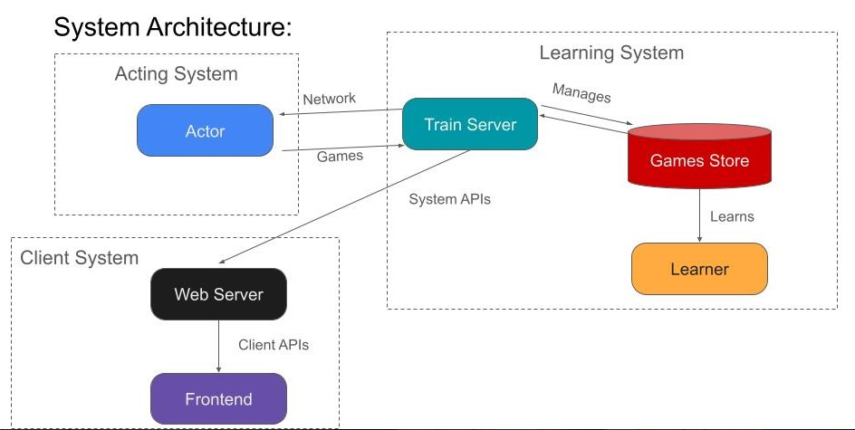
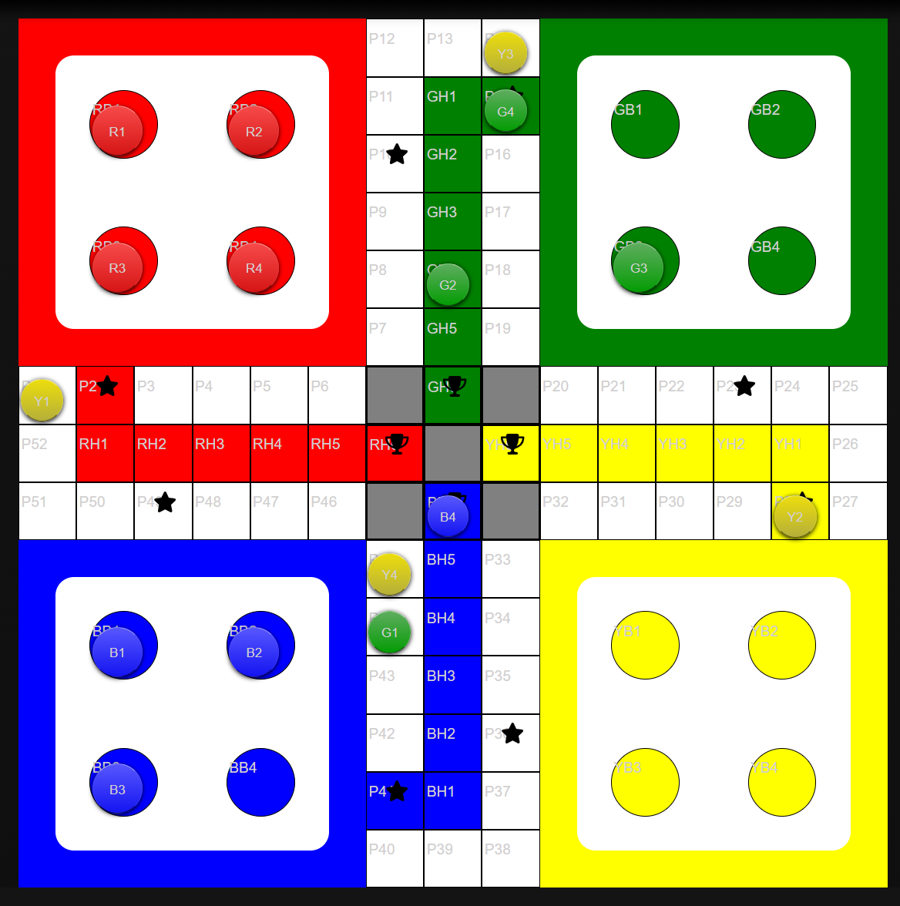

# AlphaLudo 
## Solving the game of Ludo using Reinforcement Learning

### Introduction
Ludo is an ancient Indian board game which is very widely played in India. It is 
highly stochastic and complex with a large branching factor, a major challenge 
for Artificial Intelligence researchers. We try to build an agent using reinforcement 
learning for a game of doubles (meaning that it can be played by only two players, each 
player choosing two alternate colours) and a complete report of our work can be found here.
[Attach link to Report file].

### Team Details
This project is done as part of the Term Paper for CS512 (Artificial Intelligence) at IIT Ropar, India. 
The group members are:
- Rajtilak Pal, M. Tech., AI, Entry No.- 2022AIM1010
- Protyay Dey, M. Tech., AI, Entry No.- 2022AIM1009

 

### Code Package Structure
The package structure is simple containing only two main folders: `ludobackend` and `ludofrontend`, in the root level 
directory. `ludobackend` consists of all the code written in pure Python for the game engine
and reinforcement learning system. `ludofrontend` contains a ReactJS frontend server which serves 
a website to provide Ludo game visualization tools. 

### Live Play

If you want to play live with our agent, please follow the steps to get the 
system up and running:
- Download the code base from this repository.
- Download the agent files from this [Link](https://drive.google.com/file/d/1TNUb4V8PwDj22L3lj0aUhT_GB72o4V6R/view?usp=drive_link). 
Unzip the files and keep the `runs` top directory inside `ludobackend/`.
- Create a conda environment with the packages mentioned in `ludobackend/requirements.txt`
except `tensorflow==2.10`. To install `tensorflow==2.10`, follow the directions given in the 
[Tensorflow](https://www.tensorflow.org/install/pip) website.
- Navigate to `ludofrontend/` using a terminal and run command `npm install`. For this command
to run, you need to have `npm` installed.
- Navigate to `ludobackend` using a terminal with your conda env active.
- Run `ludobackend/train_server.py` file using the python command. It will start a `RPyC` server using `port=18861`.
- Run `ludobackend/web_server.py` file using the python command. This will start a `Flask` server using `port=5000`.
- Navigate to `ludofrontend` and run `npm start`. This will open up a website in your default
browser which you can then use to play live.
- Once the website is up, click on the `Live Play` button in the Navbar. Now you can choose the colour set from this page.
- Once the colour set is chosen, you will be redirected to a screen with the Ludo board with `Player 1` as
the AI agent and `Player 2` as you.
- When it's your turn, clicking on a pawn activates the positions that you would want to 
move that pawn to based on the current roll. Then, choose the position that you would want your chosen pawn to move to.
If there are less than 2 moves for you, the system automatically takes the move for you.
- Follow the rules mentioned in `rules.txt` and play till the end to find out who the Boss is.


## Developer Documentation

We apply AlphaZero style implementation to solve this game. We provide the system architecture and reference for all the code.

### System Architecture

 

We divide our system into three main components: `Learning System`, `Acting System` and `Client System`. These systems can run on
different machines and the communications are maintained through RPCs and HTTP. 
- `Learning System`: This system learns from generated data and trains a Value network. It stores all generated games, checkpoints 
logs.
- `Acting System`: This system is responsible for generating games. 
- `Client System`: This system is responsible for giving visualization tools to view the training process, training games and live play.

#### High-level Overview
The `Learning System` stores checkpoints of the value network. The actors in the `Acting System` uses the `Train Server` to pull different
checkpoints and generate games using them. Then, they send the generated games back to the `Train Server` which stores these
games. The `Learner` asynchronously learns from these generated games and stores periodic checkpoints. The `Web Server` is 
responsible for interfacing with the `Train Server` to provide APIs for game visualization and live play. The `Frontend` uses
the APIs of the `Web Server` to show the generated games and lets the users play live with the current agent.

#### Learning System
The learning system consists of a server, `Train Server` which is responsible for serving any client with anything 
related to training. For example, it serves the actors by giving them the latest and previous checkpoints, stores 
the games generated from them, it serves the web server with different game files to visualize and so on. The 
learning system maintains a directory hierarchy for training and it is inside `ludobackend/`. We now describe how games and checkpoints are stored.

- `runs`/
    - `run<i>`/
        - `checkpoints`/
        - `experience_store`/
        - `logs`/

The top folder `runs` stores data for different training runs of the system. Inside it, we store each run as `run<i>`.
Each run consists of `checkpoints/` storing multiple tensorflow keras model saves, `experience_store/` storing game files 
for training, and `logs/` storing game files for visualization. The format of game files for `experience_store/` and `logs/` are given later.

The `Learning System` also contains a `Learner` which loads the latest checkpoint and starts learning from data inside the 
`experience_store/` periodically saving new checkpoints. 

#### Acting System
This system consists of `Actor` which is responsible for generating games after pulling checkpoints from the `Train Server`. 
The `Actor` does not need any storage, but memory to run search and generate games. You can run multiple actors in parallel.

#### Client System
This system consists of a `Web Server` made from the `Flask` library which exposes APIs for 
training game visualization and live play using APIs of `Train Server`. It mainly serves the
`ludofrontend/` frontend ReactJS application. 

### File descriptions

- `ludobackend/`: Main System source files
    - `initializer.py`: This file initializes the training process by creating the directory structure and saving random
  checkpoints. You can change the `run<i>` number by changing the variable inside `__main__`. This file must be run before 
  beginning a new training run.
    - `train_server.py`: It runs the `Train Server` which is an `RPyC` service on a default port of `18861`. The port can be 
  changed by using the `--port` option which is required when running multiple `Train Servers` on a single machine. 
  You can change the directory that this server is serving from by changing the global variables inside the file. The server
  contains APIs for getting a list of checkpoints: `get_nnet_list()`, getting a single checkpoint: `get_nnet(checkpoint_name)`, 
  storing a game's data: `push_game_data(data, log)`, getting a list of log filenames: `get_log_filenames(max_files)` and getting
  the contents of a log file: `get_log_file(path)`. To see a usage of these methods, follow `web_server.py` and `actor2.py`.
    - `actor2.py`: This is the fast actor that we talk about in our report. It does not use search
  to make move decisions while playing a game. It communicates with the `Train Server` to pull checkpoints and send back
  generated games. It uses the game engine written in `ludo.py` to generate games. By default, this file tries to find a 
  `Train Server` on `localhost` but you can modify the `TRAIN_SERVER_IP` global variable if you `Train Server` is running 
  on a different machine. To change the port and selection temperature use the `--tport` and `--stemp` options respectively 
  when running the file.
    - `learner.py`: It runs the `Learner` which pre-fetches mini-batches of states from multiple game files on
  a background process to feed the training process. The network is continually updated with the gradients of the loss and
  is saved in `checkpoints/` every 1000 iterations. The `Learner` first checks whether there are enough games in the `experience_store/` and then
  starts the training process. You can change the training hyperparameters by changing the global variables.
    - `ludo.py`: This file contains the main game logic. It contains a `GameConfig` class which defines what the configuration
  of a game is. A game can be of two player doubles, two player singles, three player singles and four player singles.
  It contains a `LudoModel` class which is stateless independent implementation of the game logic. This means that 
  it applies game logic only to the state provided by the user. It also contains a `Ludo` class which is a stateful engine.
  To perform look-ahead search `LudoModel` must be used since it is stateless and not `Ludo`. An object of the `Ludo` class is
  only used to keep track of the main game progression and not look-ahead search. Take a look at `actor.py` to get an idea.
    - `actor.py`: This is another version of an `Actor` which uses MCTS (Monte-Carlo Tree Search) to take move decisions. It uses
  `mcts.py` to get the MCTS methods. We perform the search in the `actor.py` process and launch a background process from
  `evaluator.py` to perform neural network evaluations. MCTS requires its leaf nodes to be evaluated from the value network.
  Since, MCTS is run on multiple threads, it generates multiple evaluation requests at the same time requiring multiple copies
  of the network for simultaneous evaluation. We take a different route and keep only one copy of the network in 
  the background `evaluator` process and expose a `RPyC` server which can serve multiple evaluation requests from 
  the main `actor.py` process. To change the `Actor` parameters, use the global variables as there are 
  no options available while running this file.
    - `ts_elo.py`: This is another version of the `Train Server` which stores games for generating Elo Rating. It redirects
  the games to a different directory meant for the calculation of Elo Rating.
    - `actor_elo.py`: This is another version of the `actor2.py` which generates games for calculating Elo Rating. It
  plays games between a mentioned checkpoint and a random agent (An agent that takes decisions randomly).
    - `stats.py`: This file is used to calculate win rate statistics for games that were stored for the calculation of Elo 
  Rating.
    - `*.sh`: All `.sh` files are used to run their corresponding `.py` files utilizing the options they provide.
- `ludofrontend/src/`: ReactJS frontend source files.
  - `App.js`: Main entry point for the `npm start` command.
  - `components/`: This folder has all the ReactJS components that makes up the website.
  - `Api.js`: Contains all the API requests to the `Web Server`. If your `Web Server` is running on a different 
  machine/port, make sure to change the `API_URL` constant at the top of the file.

### Board Description
 

The Ludo board consists of 4 `bases` for 4 colours. Each `base` contains 4 `positions` to hold 4 `pawns`. The
`Main Track` consists of the 52 different positions apart from a `Home Stretch` per colour of 5 non-final positions and a 
final position. A `pawn` starts its movement from its `base`, goes through one loop of the `Main Track` and completes
the `Home Stretch`. We ID each of the `pawns` with `<C>1` to `<C>4` where `<C>` is the first initial of the colour in capital letters. .
We also ID each position in the `Main Track` by `P1` to `P52`. We ID each base position using `<C>B1` to `<C>B4` where `<C>`
indicates the colour initial in capital. Lastly, we ID each of the `Home Stretch` positions using `<C>H1` to `<C>H6`.

### Game file formats
For each generated game, we store two different files for it, one in the `ludobackend/runs/run<i>/logs/` folder and another in 
the `ludobackend/runs/run<i>/experience_store/` folder. The game file stored in `experience_store/` is a compact version of the 
game storing only the information required for training the networks and optimized for state sampling. The game file
stored in `logs/` folder is much more verbose and is meant for visualizing the game step by step. Both the files are stored
in `JSON` encoding and can be formatted by any `JSON` formatter. We describe the formats for both the files next.

- File in `experience_store/`:
```
{
    player_won: 1 /* Indicates the 1-indexed index of player who won the game */,
    states: [] /* List of all states of the game in Tensor representation as described in the report */,
}
```
- File in `logs/`:
```
{
    config: { /* The configuration of the game, how many players and what colours have they chosen */
        players: [ /* List of players */
            <i>: {
                name: "Player 1" /* ID of the player */,
                colours: [] /* List of colours */
            }
        ]
    },
    game: [ /* Contains the states and moves taken */
        <i>: { /* Indicates the current state, move taken and top_moves */
            game_state: {/* Current State of the game */
                game_over: false /* Indicates whether the game is over at this point or not */,
                pawns: { /* Pawn descriptions */
                    <pawn_id>: {
                        colour: red,
                        blocked: false /* Whether the pawn is a part of a block or not */,
                    }
                },
                positions: [ /* Contains list of all occupied positions */
                    <j>: { /* Pawn positions */
                        pawn_id: "R1",
                        pos_id: "RB1"
                    }
                ],
                current_player: 0 /* Key of the player in config.players */,
                dice_roll: [] /* The roll values of each throw */,
                last_move_id: 0 /* The move id that was begin expected while playing the game. See ludo.py for better understanding */,
                num_more_moves: 1 /* Indicates the number of more moves left for the current player */,
                blocks:[ /* List of all blocks present in this state */
                    <j>:{
                        pawn_ids: [ /* List of Pawn ids making the block */],
                        rigid: true /* Boolean indicating whether the block is rigid or not */,
                    }
                ]
            },
            move_id: 0, /* Move ID of this game */
            move: [] /* Move representation of the move taken */,
            top_moves: [ /* Contains the top 10 moves that the AI thought might be worth taking */
                <j>: {
                    move: [],
                    prob: 1.0 /* The probability of taking that move */,
                    value: 0.1 /* OPTIONAL, It is how much the AI values the next state after taking the move */
                }
            ]
        }
    ],
    player_won: 1 /* Indicates the 1-indexed index of player who won the game */,
}
```

**Note: The state json object in `logs/file.json` is different from the state dictionary in `ludo.py/Ludo` class.**

### Training the system

To train the system from scratch, we follow the steps:
- Navigate to `ludobackend/`.
- First run the `initializer.py` file to initialize the directory structure and create a random checkpoint.
- Next, run the `train_server.py` on a particular port to serve actors and clients for visualization purposes.
- Next, run the `actor2.py` to start a fast actor or `actor.py` to start a MCTS actor with the appropriate `Train Server` ip and port.
You can also start multiple actors parallely on the same system. If starting multiple `actor.py`, make sure to use a different `evaluator` port for each actor.
- Next, run the `learner.py` to start the learner. The learner won't start until a number of games have already been generated.
- To visualize the games that are being generated and the values that the network is assigning to states, run the `web_server.py`.
- Navigate to `ludofrontend/`. Then, run command `npm start`.
- A website will open. Click on the `visualizer` button on the Navbar. Selecting a `run` will list you the log files in that run.
Click on a `log` file to visualize the game. Then, step through the game to see what moves were taken by the agents and the top moves.

